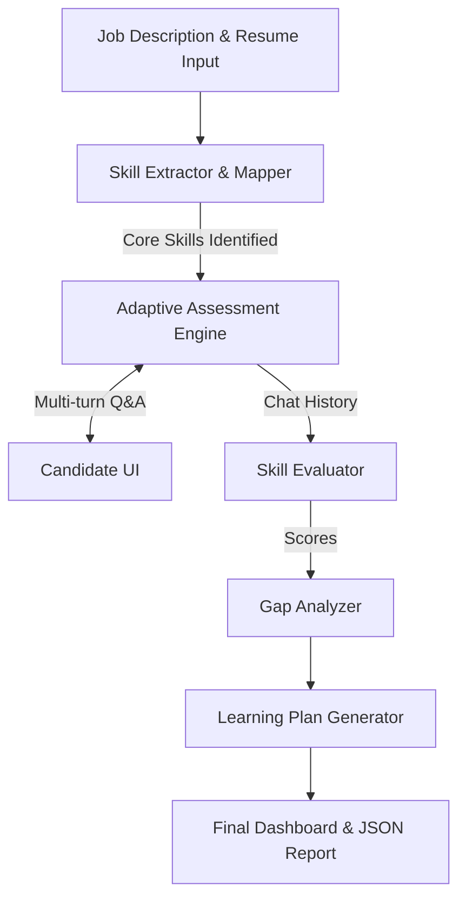

# AI Skill Assessment Agent

This is an AI Skill Assessment & Personalized Learning Plan Agent built for evaluating candidates against a Job Description (JD). It uses an adaptive multi-turn questioning process, quantifies proficiency, identifies precise skill gaps, and generates a realistic, time-bound learning plan with curated resources.

## Features
- **Skill Extraction**: Automatically extracts and normalizes skills from a Job Description.
- **Skill Mapping**: Maps the candidate's resume against the extracted skills to identify matches and gaps.
- **Adaptive Assessment**: Conducts a multi-turn terminal-based interview, dynamically adjusting question difficulty based on the candidate's responses.
- **Skill Scoring**: Scores candidate skills on a 0-5 scale.
- **Gap Analysis & Learning Plan**: Generates a detailed gap analysis and a personalized learning plan based on the assessment results.

## Requirements
- Python 3.8+
- A Google Gemini API Key

## Setup & Installation (For Hackathon Judges)

Follow these steps to set up and run the agent locally.

1. **Clone the repository**
   ```bash
   git clone https://github.com/MohdFareed37/Ai-Skill-Assessment-Agent.git
   cd Ai-Skill-Assessment-Agent
   ```

2. **Install Dependencies**
   It's highly recommended to use a virtual environment.
   ```bash
   pip install -r requirements.txt
   ```

3. **Get a Gemini API Key**
   - Go to [Google AI Studio](https://aistudio.google.com/) and sign in.
   - Click **"Get API key"** on the left menu.
   - Click **"Create API key"** and copy the generated key. (It's completely free to use the generous free tier).

4. **Environment Setup**
   - Copy the `.env.example` file to create a `.env` file:
     ```bash
     # On Windows (Command Prompt):
     copy .env.example .env
     
     # On Mac/Linux:
     cp .env.example .env
     ```
   - Open the `.env` file and replace `your_api_key_here` with the API key you copied.

5. **Run the Agent**
   ```bash
   python main.py
   ```

## Usage
Once you run `python main.py`, the CLI will guide you through the process:
1. It will prompt you to paste a Job Description (Type `EOF` on a new line when done).
2. It will prompt you to paste a Candidate Resume (Type `EOF` on a new line when done).
3. The agent will process the inputs and begin the interactive technical interview in the terminal.
4. Answer the questions as the candidate to test the assessment logic.
5. After the questions are complete, a final structured JSON report will be printed out with scores, gap analysis, and the learning plan.

## Architecture & Logic

### Architecture Diagram


### Scoring Logic
The assessment agent uses a highly structured rubric to evaluate the candidate's answers for each skill. The LLM evaluates the chat history based on **correctness, depth, and practical application**, and assigns a score from 0-5:
- **0**: No knowledge
- **1**: Basic awareness (definitions only)
- **2**: Theoretical understanding, no application
- **3**: Working knowledge, simple use cases
- **4**: Strong practical, real-world usage
- **5**: Expert, optimization/design level

Based on the required skills from the Job Description, the agent classifies gaps as **Critical** (score <= 2 for core skills) or **Improvement Areas** (score = 3), and creates a targeted learning plan to bridge those gaps.

## Sample Inputs & Outputs

**Sample Input (JD):**
> Looking for a Backend Developer with strong Python skills. Experience with building RESTful APIs using FastAPI or Django is required. Must know SQL and Git.

**Sample Input (Resume):**
> Software Engineer with 2 years of experience. Built several web applications using Python and Flask. Familiar with basic SQL queries. Used Git for version control.

**Sample Output (Dashboard Summary):**
- **Skills Extracted**: Python, FastAPI, Django, SQL, Git.
- **Skill Mapping**: 
  - Matched: Python, SQL, Git
  - Missing/Partial: FastAPI, Django
- **Assessment**: The agent dynamically interviews the candidate on Python and SQL. (e.g., Python Score: 4/5, SQL Score: 2/5).
- **Gap Analysis**: SQL is identified as a critical gap due to the low score. FastAPI is identified as a critical gap due to missing resume evidence.
- **Learning Plan**: Actionable plan generated with estimated timelines (e.g., "Advanced SQL - 3 Days", "FastAPI Crash Course - 5 Days").
